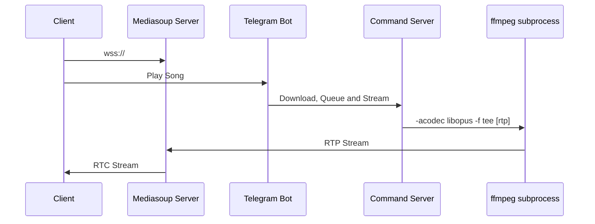
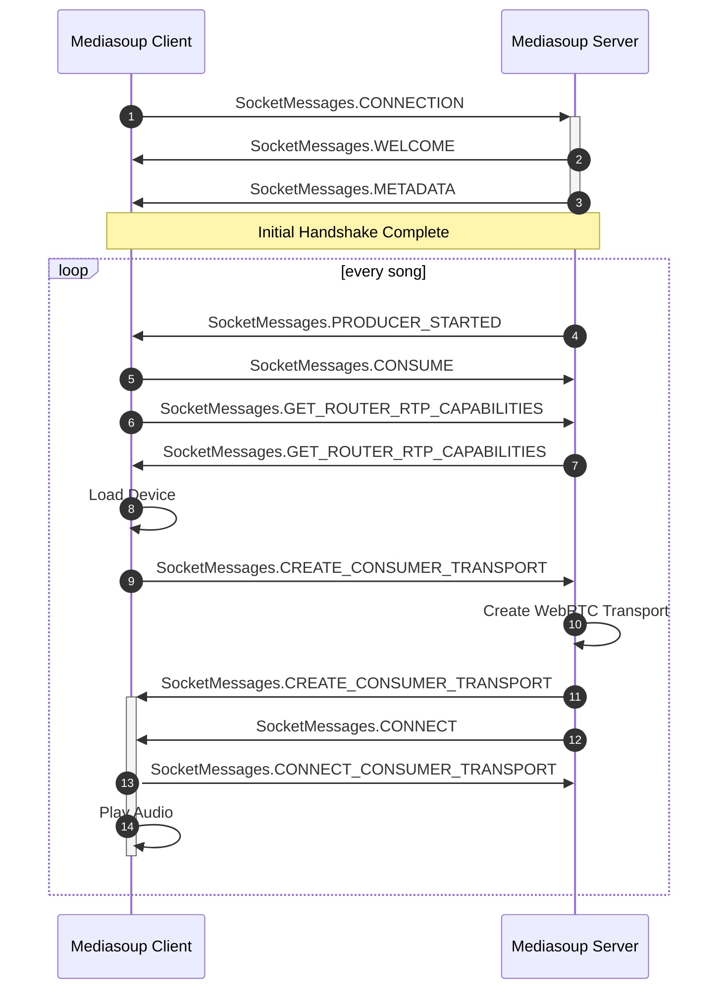

# 📻 Localhost FM

## ⚠ Extremely Alpha

This is something I threw together over an idle weekend. There's a bunch of improvements I'd like to make:
- improve the hacky `ffmpeg` subprocess to convert the audio to an RTP stream
- `useContext` for the actual wss connection via [Remix](https://github.com/remix-run/examples/tree/main/socket.io)
- add a queue on the website
- ability to request music on the website

You can find a live example here: https://radio.superserio.us/

If nobody's playing music via the [Telegram bot](https://t.me/SSRadioBot), it'll play from a list of previously played songs.

## Architectural Overview

- All music queue logic and commands are encapsulated within the Telegram bot
- The Telegram script downloads the requested song off of YouTube and queues a `ffmpeg` process
- Mediasoup client-server communication happens over WebSockets

## Orchestration Flow

## History

I previously used Liquisoup + Icecast for this project but **everyone** complained about the 2 minute long wait to listen to the song they had just queued up. I attempted another solution with `nginx` + HLS chunks but that could only get me as close as < 15s.

This WebRTC certainly will not scale for a high number of users. If your intent is to scale to millions of concurrent listeners I can highly recommend what [radiofrance](https://archive.fosdem.org/2020/schedule/event/om_audio_streaming/attachments/slides/4026/export/events/attachments/om_audio_streaming/slides/4026/opensource_streaming_platform.pdf) uses (Liquidsoap + Icecast): 
